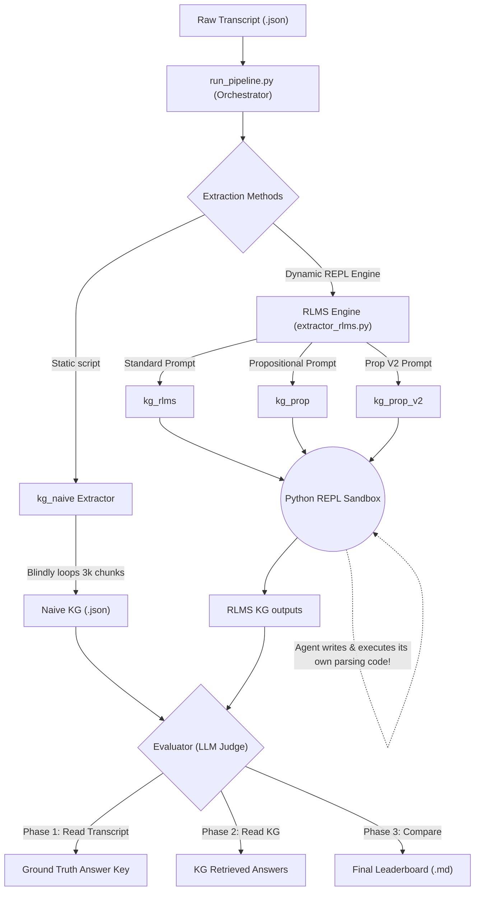

# BrainDrain: Recursive Language Model (RLM) Extractor

An experimental pipeline that dynamically generates Python code using a "Recursive Language Model" (RLM) prompt, executing it inside a sandboxed environment to extract structured knowledge graphs (or other compaction schemas) from massive conversational transcripts.

## Concept
Instead of statically parsing JSON with fixed python scripts, this project uses a meta-prompt to ask an LLM to **write its own chunking, parallelism, and extraction Python loop**. We then execute that generated loop inside a highly secure Podman sandbox.


## Architecture Diagram

```mermaid
flowchart TD
    A["Raw Transcript (.json)"] --> B["run_pipeline.py (Orchestrator)"]

    B --> C{"Extraction Methods"}

    %% Static Branch
    C -->|"Static script"| D["kg_naive Extractor"]
    D -->|"Blindly loops 3k chunks"| E["Naive KG (.json)"]

    %% Dynamic RLMS Branch
    C -->|"Dynamic REPL Engine"| F["RLMS Engine (extractor_rlms.py)"]
    
    F -->|"Standard Prompt"| G["kg_rlms"]
    F -->|"Propositional Prompt"| H["kg_prop"]
    F -->|"Prop V2 Prompt"| I["kg_prop_v2"]

    G --> J(("Python REPL Sandbox"))
    H --> J
    I --> J

    J -.->|"Agent writes & executes its own parsing code!"| J
    J --> K{"Did Agent save JSON file?"}
    
    K -->|Yes| P["RLMS KG outputs"]
    K -->|No (Crashed or failed disk write)| Q["Intercept raw text output"]
    
    Q --> R["REPAIR LLM (Fallback)"]
    R -->|"Coerces raw text into strict schema"| P

    %% Evaluation Phase
    E --> L{"Evaluator (LLM Judge)"}
    P --> L

    L -->|"Phase 1: Read Transcript"| M["Ground Truth Answer Key"]
    L -->|"Phase 2: Read KG"| N["KG Retrieved Answers"]
    L -->|"Phase 3: Compare"| O["Final Leaderboard (.md)"]
```



## Features
- **Dynamic Prompt-to-Code**: The extraction script is written dynamically based on your schema prompts.
- **Resilient Checkpointing**: The generated scripts are instructed to aggressively save chunk-by-chunk state (`output_rlm.json`) to recover from rate limits.
- **Multi-Model Evaluator**: Built-in `evaluator.py` acts as an LLM Judge, comparing the compacted graph to the raw 8,000-character transcript.

## Setup

1. **Environment Variables**:
   Export your NVIDIA API key:
   ```bash
   export NVIDIA_API_KEY="nvapi-..."
   ```

2. **Start the Pipeline**:
   You must run the orchestrator inside Podman to ensure the dynamically generated Python code is securely sandboxed. The automated pipeline (`run_pipeline.py`) manages extraction across multiple methods (Naive, RLM, Propositional) and automatically runs the LLM Evaluator on all of them. The script will automatically load your `.env` file.
   
   ```bash
   # Run the pipeline on a single file:
   podman run --rm -v $(pwd):/app braindrain python run_pipeline.py data/secure/inputs/test-case-conversation.json
   
   # Or run batch processing (resumable):
   podman run --rm -v $(pwd):/app braindrain python run_pipeline.py --all
   ```

## Directory Structure and JSON Artifacts

All JSON extraction and evaluation artifacts are strictly routed to the `data/` directory to prevent repository pollution:

- `data/secure/inputs/`: Your raw conversational transcripts go here.
- `data/working/scrubbed_inputs/`: PII-scrubbed copies of your transcripts.
- `data/working/pipeline_runs.jsonl`: The master telemetry log. Records the success/failure state, Pydantic validation outcomes, error stack traces, and LLM scores for every single run.
- `data/working/evaluations/<transcript_name>/`: **This is where all generated JSON files live.** It contains:
  - `kg_naive_...json`, `kg_rlms_...json`, `kg_prop_...json`: The raw knowledge graphs extracted by each method.
  - `<transcript_name>_answer_key.json`: The "Ground Truth" Answer Key generated by the LLM Judge.
  - `kg_..._retrieved.json`: The answers the Retriever pulled exclusively from the graphs.
  - `kg_..._scores.json`: The raw 0-100 scores and explanations from the Judge.
  - `leaderboard_...md`: The final markdown leaderboard ranking the methods.
- `data/secure/reconstituted/`: Where PII is theoretically merged back into the winning graph.
- `llm_cache/`: Stores permanently cached LLM responses based on hashed prompts.

## Prompt Variations
Check `src/prompts/` for alternative compaction techniques (e.g. Propositional Extraction vs. 4-part Knowledge Graphs).

## Extraction Methodologies
We test four different methods to parse a raw transcript into a structured Knowledge Graph:
1. **`kg_naive` (The Baseline):** A static script (`src/extractor.py`) that loops through the transcript in fixed **10,000-character** chunks, using a basic prompt to extract semantic nodes/edges and episodic events.
2. **`kg_rlms` (The Autonomous Agent):** The advanced approach (`src/extractor_recursive.py`). It uses an orchestration loop to chunk the text and prompts the LLM to parse the text into a 4-part cognitive schema (Semantic, Episodic, Procedural, Active) using a strictly nested hierarchical structure.
3. **`kg_propositional`:** This uses the exact same recursive engine as above, but injects a custom prompt (`src/prompts/propositional_kg.txt`) to shift the schema focus towards declarative facts and propositional logic.
4. **`kg_propositional_v2`:** A massive architectural shift. Uses a modified prompt (`src/prompts/propositional_v2_kg.txt`) that completely flattens the hierarchical JSON schema into pure Subject-Relation-Object triples.

## Evaluation Strategy
The pipeline uses a 3-Stage LLM Judge (`src/evaluator.py`) to grade the KGs without human intervention:
1. **The Answer Key (Ground Truth):** The LLM reads the *raw, unparsed transcript* and answers 15 specific questions across 5 cognitive domains (3 attempts per question, synthesized into one final answer).
2. **The Retrieval:** The LLM is given only the *extracted JSON Knowledge Graph* (it cannot see the transcript) and must answer those exact same 15 questions.
3. **The Grading:** The LLM Judge compares the Retrieval answers against the Ground Truth Answer Key and outputs a 0-100 score for accuracy.

## The Judge Rubric (15-Question Domain Matrix)
The evaluator dynamically scores the graph across 5 distinct domains to test comprehensive memory retention:
1. **Control (Surface Retrieval):** Tests verbatim extraction (e.g., exact quotes, specific identifiers). Proves the graph isn't hallucinating.
2. **Semantic (Relational):** Tests abstract comprehension (e.g., core conflicts, functional definitions).
3. **Episodic (Temporal):** Tests timeline logic (e.g., sequence of events, narrative shifts).
4. **Procedural (Frameworks):** Tests system mapping (e.g., step-by-step mechanisms, established rules).
5. **Active (State):** Tests context awareness (e.g., unresolved tensions, immediate next steps).

## Experiment Log & Learnings

### Experiment 1: Agentic Sandbox (RLM) Failure
**Hypothesis:** An autonomous agent running in a Python REPL sandbox can ingest a 77,000-character transcript, dynamically write its own chunking script, and build a cohesive knowledge graph.
**Result:** FAILED. 
**Observations:** Forcing a non-deterministic LLM to dynamically write deterministic Python `for` loops to handle massive pagination is an architectural anti-pattern. The orchestrator must handle deterministic chunking natively.

### Experiment 2: Naive JSON Parsing & Silent Data Loss
**Hypothesis:** A basic string search for `{` and `}` is sufficient to isolate and parse JSON from raw LLM text outputs.
**Result:** FAILED.
**Observations:** The "Silent Drop" Bug caused 35% data loss. LLM extraction pipelines must use robust Regex block parsing (`re.findall`) or native API JSON-mode constraints. A "clean" run cannot be trusted without explicit parsing validation.

### Experiment 3: LLM Judge Context Window & API Timeouts
**Hypothesis:** An LLM Judge (`evaluator.py`) can accurately evaluate extraction quality by generating ground-truth answers via zero-shot queries against the complete 77,000-character raw transcript.
**Result:** DEGRADED / CONGESTED.
**Observations:** Free-tier API gateways (like NVIDIA and OpenRouter pools) aggressively rate-limit or timeout massive payloads. Bumping the chunk size from 3,000 to 10,000 characters massively increased semantic context and drastically reduced the total API calls needed, making the pipeline viable on paid enterprise endpoints (like Llama-3.1-70B on OpenRouter).

### Experiment 4: Schema Flattening & Syntax Friction
**Hypothesis:** Flattening a hierarchical nested JSON schema into relational triples (Subject-Relation-Object) will improve LLM extraction accuracy by reducing syntax generation overhead.
**Result:** MASSIVE SUCCESS.
**Observations:** 
1. **Validation Failures:** The `kg_rlms` and `kg_propositional` schemas forced the LLM into deeply nested lists of dictionaries. The LLM rebelled, prioritizing semantic facts over syntax (e.g., outputting a list of strings instead), which caused hard Pydantic validation failures.
2. **Triple Dominance:** `kg_propositional_v2` flattened the entire cognitive map into pure triples. The syntax friction vanished, allowing the LLM to allocate its full context budget to deep semantic extraction.
**Conclusion:** `kg_propositional_v2` achieved an **87.5%** accuracy score against the baseline's **65.0%**, proving that syntax friction actively destroys semantic extraction. Furthermore, V2's triple-based output natively aligns with Dialogue Relation Extraction (DialogRE) benchmarks, priming the architecture for academic datasets.
